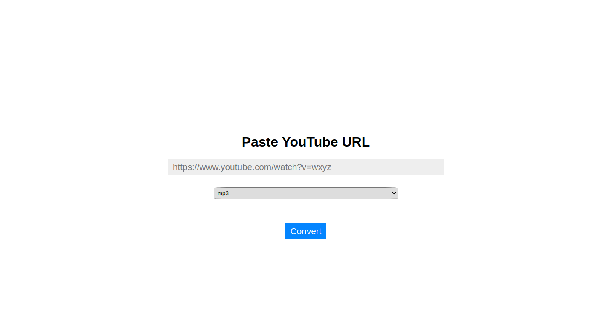

> ## Simple App to download youtube video in `mp3` and `mp4` format

### clone application local

1. Clone the application in your local machine and run command

```sh
git clone https://github.com/himnsuk/ytdl-app.git
```

### Running application local

Navigate to directory by `cd ytdl-app`

Open terminal and navigate to `ytdl-app` directory then run

```sh
npm install
```
After it run successfully and install all the required dependency run

```sh
npm run start
```

Open your browser and navigate to `http://localhost:4000`

## Voila!

---

### Running application local using docker

Navigate to directory by `cd ytdl-app`

> _insure you have docker and docker-compose installed_

#### Using docker build

Inside the terminal run command to build image

```sh
docker build .
```

After build process complete run container with above image

```sh
docker run -p 4000:4000 c85c82bf99bc // Update your image id
```

Open your browser and navigate to `http://localhost:4000`

#### Using docker-compose

Inside the terminal run command to build and run the image

```sh
docker-compose -f docker-compose-dev.yml up
```

After build complete open your browser and navigate to `http://localhost:4000`

--- 

## Deploying solution to Heroku

Inside terminal run command

```sh
heroku container:login
```

After you logged in into heroku run

```sh
heroku create
```

After creating the app note down the app name for future

```sh
docker-compose up

docker tag ytdl_prod_web:latest registry.heroku.com/<HEROKU-APP-NAME>/web

docker push registry.heroku.com/<HEROKU-APP-NAME>/web

heroku container:push web

heroku container:release web
```

After running above commands run below command to open the app in browser

```sh
heroku open
```

## Voila!

---

[Live Demo](https://ytdl1-app.herokuapp.com/)

Demo image




## Thanks!